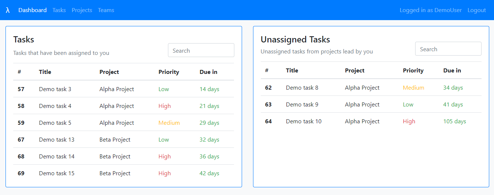

# Lambda

Lambda is a project and task management web application built with Python and
Django. Check out a live version
[here](https://rorysullivan.pythonanywhere.com/).

## Framework

There are three main types of objects in Lambda; teams, projects and tasks.
Projects are assigned to a team and tasks are assigned to a project.

### Teams

Teams are made up of members, and every team has a leader. Team leaders have
special privileges like being able to assign tasks to other team members and
changing the members of the team. Note that in the default implementation a user
can only create a team with members who they are already connected with (i.e.
already have a team in common) unless they have special privileges. The ability
to connect with any other user of the system is something I want to add in the
future.

### Projects

Every project is assigned to a team and thus has members and a leader associated
with it. A project can only be assigned to one team but a team can have many
projects. Once a project is over it can be marked as completed.

### Tasks

Tasks are assigned to projects. Once a task has been assigned to a project it
can be assigned to a member of the project's team, it will then appear on a list
of their active tasks. Tasks can be assigned by team members to themselves or by
the team leader to anyone on the team. Any member of a project's team can create
a task for the project. Every task is given a unique number that can be used to
refer to it independent of the project or user it is assigned to. Tasks can also
be marked as completed, this is generally done by the user that the task is
assigned to, but may also be done by the team leader.

## The Dashboard

One of the main features of the site is the user's dashboard (see the above
image). Currently this shows four key tables, though this may change in the
future.

### 1) Top tasks

This is a list of the user's top seven tasks, tasks are ranked firstly by due
date and then by priority (in other words the highest priority task that is due
today is at the top).

### 2) Unassigned tasks

A list of the top seven unassigned tasks from projects where the user is the
team leader, again sorted by due date and priority.

### 3) User's projects

A list of all active projects the user is a part of.

### 4) User's teams

A list of teams the user is a part of.
